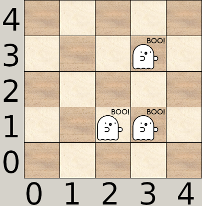
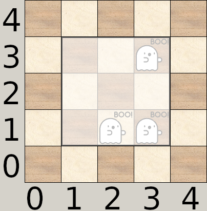

# Bedsheet ghosts

After losing your companions in the darkness of the forest, you arrive at the holiday cottage, which actually looks more like a manor house. Horror and disbelief, the front door is locked! So, naturally, you enter through the upstairs window. After all, it's not a door that's going to put an end to your vacation.

A new scare: the ground floor is full of ghosts! Since you are already upstairs, you have the brilliant idea of catching them by dropping a large bedsheet over them.

The position of each ghost on a grid is given. What is the minimum surface area of the sheet needed to catch all the ghosts at once? A sheet is a **square** and you can't turn it.

## Data

### Input

**Line 1**: an integer `N`, the number of ghosts, `0 < N <= 1000`.

**The following `N` lines**: two integers `X``i` and `Y``i` separated by a space, the coordinates of the `i``th` ghost, `0 <= X``i``, Y``i` `<= 1000`.

### Output

The minimum surface area of the **square** sheet to catch all the ghosts at once.

## Examples

### Example 1

#### Input

```plaintext
3
1 1
2 1
3 3
```

#### Output

```plaintext
9
```

For this arrangement of ghosts:



The sheet can be positioned as follows:




The result is a surface area of 9.

### Example 2

#### Input

```plaintext
4
1 1
5 1
5 3
2 3
```

#### Output

```plaintext
25
```

There are several ways of positioning the sheet, but the minimum surface area is always 25.