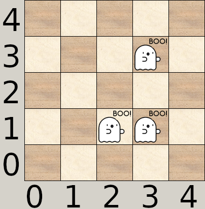
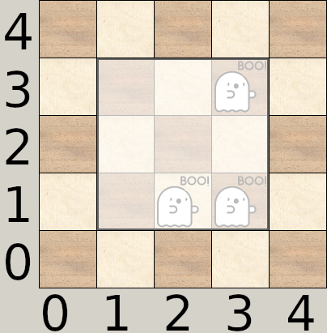

# Dans de beaux draps

Après avoir perdu vos compagnons dans la pénombre de la forêt, vous arrivez devant le gite, qui ressemble d'ailleurs plutôt à un manoir. Horreur et stupéfaction, la porte d'entrée est verrouillée ! C'est donc tout naturellement que vous entrez par la fenêtre de l'étage. Après tout, ça n'est pas une porte qui mettra fin à vos vacances.

Nouvel effroi : le rez-de-chaussée est rempli de fantômes !? Étant à l'étage, vous avez la brillante idée de les emprisonner en laissant tomber un grand drap sur eux.

On donne la position de chaque fantôme sur une grille. Quelle est la surface minimale du drap permettant d'attraper tous les fantômes d'un coup ? Un drap est **carré** et vous ne pouvez pas le faire tourner.

## Données

### Entrée

**Ligne 1** : un entier `N`, le nombre de fantômes, `0 < N <= 1000`.

**Les `N` lignes suivantes** : deux entiers `X`<sub>`i`</sub> et `Y`<sub>`i`</sub> séparés par un espace, les coordonnées du `i`<sup>`ème`</sup> fantôme, `0 <= X`<sub>`i`</sub>`, Y`<sub>`i`</sub> `<= 1000`.

### Sortie

La surface minimale du drap **carré** permettant d'attraper tous les fantômes d'un coup.

## Exemples

### Exemple 1

#### Entrée

```plaintext
3
1 1
2 1
3 3
```

#### Sortie

```plaintext
9
```

Pour cette disposition de fantômes :



On peut positionner le drap comme ceci :



Et on obtient une surface de 9.

### Exemple 2

#### Entrée

```plaintext
4
1 1
5 1
5 3
2 3
```

#### Sortie

```plaintext
25
```

Il y a plusieurs façons de positionner le drap mais la surface minimale est toujours 25.