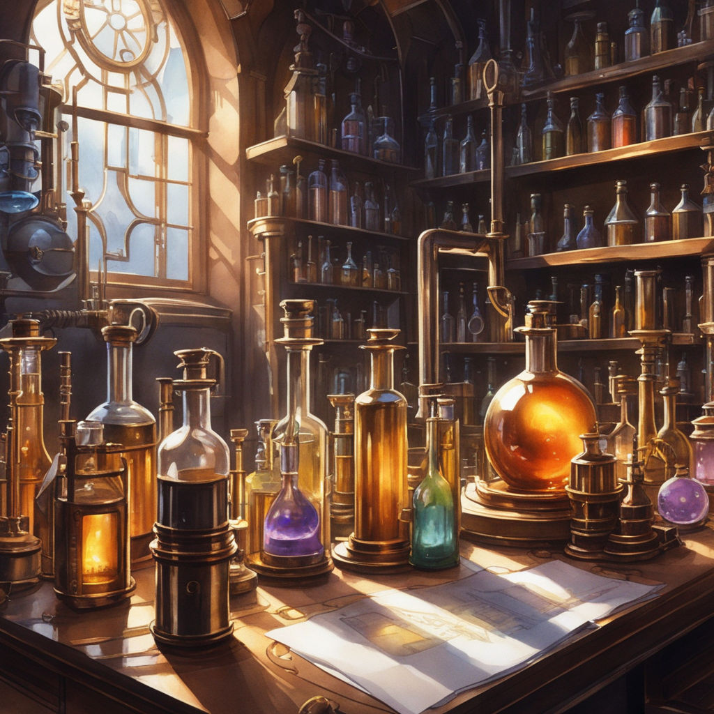

# Brewing potions

This brilliant idea wasn't as bright as it seemed: against all odds, the ghosts went through the sheet! 😱 And now you've been spotted. A frantic chase in the dark corridors of the manor follows, after which you barricade yourself in a dusty alchemy laboratory. After a meticulous inspection of the room, you find an old recipe book, some of which could very well save your life in this manor.

Each recipe allows you to make a potion from two other potions. The laboratory is stocked with an unlimited number of vials of certain potions. How many of these vials will you need to make the potion you're looking for?

## Data

### Input

**Line 1**: The name of the objective potion, a string without spaces, between 1 and 20 characters long.

**Line 2**: The `N` number of potions available in unlimited quantities.

**Line 3**: The names of the `N` potions available, separated by spaces, in the same format as the objective potion, `0 < N <= 100`.

**Line 4**: The number `M` of recipes, `0 < M <= 1000`.

**The `M` following lines**: One recipe per line, in `A B C` format, where `A` is the potion being made, and `B` and `C` the potions needed to make it (which are therefore each used once to make one potion of `A`).

There are no cycles in the recipes, i.e. a potion will never need itself to be made. For example, if `C` is available, the book cannot contain recipes `A B C` and `B A C`, because then `A` needs `B` and `B` needs `A`.

### Output

The minimum number of available potion vials used in total (those in line 3), or `impossible` if the objective potion cannot be made from available potions.

## Examples

### Example 1

#### Input

```plaintext
A
2
C D
2
B C D
A B C
```

You need to use potions `C` and `D` to make `B`, which allows you to make `A` in combination with `C`. We therefore used `C` twice and `D` once, hence the answer :

```plaintext
3
```

### Example 2

#### Input

```plaintext
I
6
L M N O P Q
4
I J K
J L M
K N O
O P Q
```

#### Output

```plaintext
4
```

Note here: the `O` potion can be made from the `P` and `Q` potions, but it is also one of the potions available. It is therefore not necessary to create it, and the expected number is 4.

### Example 3

#### Input

```plaintext
levitation
1
elixir_bleu
1
levitation elixir_bleu huile_de_licorne
```

#### Output

```plaintext
impossible
```

`huile_de_licorne` is needed for the `levitation` potion, but is not available, so it's impossible.