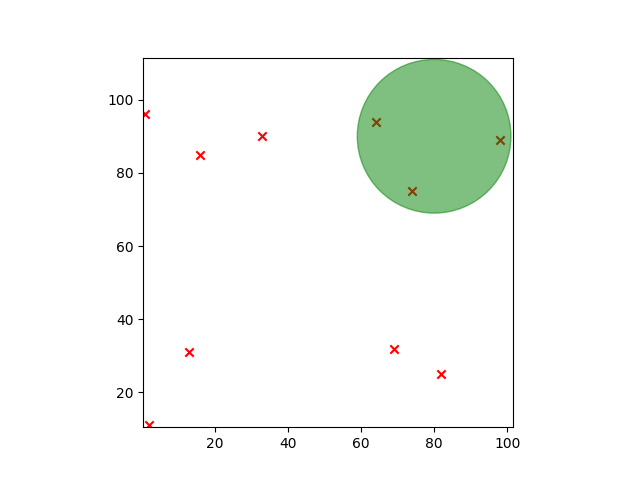
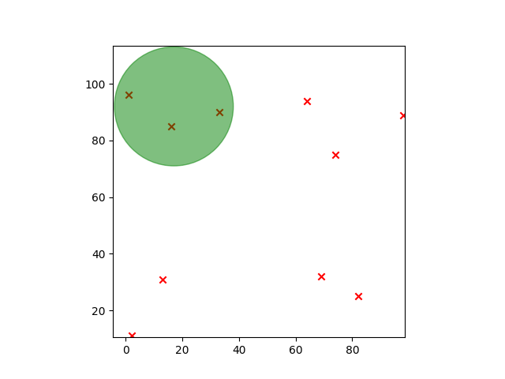

# The mansion of Luigi

The clairvoyant bursts into tears when she realizes she has lost. She gives you her most precious treasure as a sign of friendship: A super **quantum vacuum cleaner omega 9042**! Unfortunately, this one is partially discharged and its battery is only good for one use. That's when a new brilliant idea comes to mind: you're going to vacuum the ghosts! Let's hope this second attempt is more successful than the first one...

Knowing that the vacuum cleaner can vacuum all the ghosts in a given radius, how many ghosts can be sucked up at most?

## Data

### Input

**Line 1**: An integer `R`, the suction radius of the vacuum cleaner, with `0 < R <= 1000`.

**Line 2**: An integer `N`, the number of ghosts, with `0 < N <= 100`.

**The following `N` lines**: two integers `X`<sub>`i`</sub> and `Y`<sub>`i`</sub> separated by a space, the position of the `i`<sup>`th`</sup> ghost, `0 <= X`<sub>`i`</sub>`, Y`<sub>`i`</sub> `<= 1000`.
### Output

The maximum number of ghosts that can be vacuumed at once.

## Examples

### Example 1

#### Input

```plaintext
2
4
0 0
1 2
3 2
5 4
```

#### Output

```plaintext
3
```

Explanations:

The only way to vacuum 3 ghosts is to vacuum the first 3. Indeed, a position like (1.5, 1) allows you to vacuum the phantoms at positions (0, 0), (1, 2) and (3, 2), as shown in the image below:


The red `x` are the ghosts, the green circle represents the vacuum cleaner's suction radius.

### Example 2

#### Input

```plaintext
21
10
74 75
64 94
33 90
82 25
13 31
69 32
16 85
1 96
2 11
98 89
```

#### Output

```plaintext
3
```

Explanations:

This example has several solutions. Here are two examples:

- we can place ourselves in (80, 90) : 

    
- but also in (27, 92):
