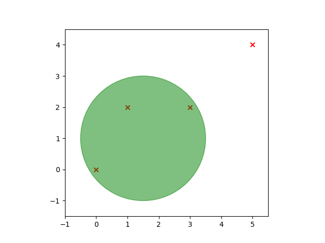

# Le manoir de Luigi

La voyante fond en larmes quand elle se rend compte qu'elle a perdu. Elle vous remet en signe d'amitié son plus précieux trésor : Un super **aspirateur quantique omega 9042** ! Malheureusement, celui-ci est en partie déchargé et sa batterie ne permet qu'une seule utilisation. C'est alors qu'une nouvelle idée géniale vous vient à l'esprit : les fantômes, vous allez les aspirer ! Espérons que cette deuxième tentative soit plus fructueuse que la première...

Sachant que l'aspirateur peut aspirer tous les fantômes dans un rayon donné, combien de fantômes peuvent être aspirés au maximum ?

## Données

### Entrée

**Ligne 1** : Un entier `R`, le rayon d'aspiration de l'aspirateur, avec `0 < R <= 1000`.

**Ligne 2** : Un entier `N`, le nombre de fantômes, avec `0 < N <= 100`.

**Les `N` lignes suivantes** : deux entiers `X``i` et `Y``i` séparés par un espace, la position du `i``ème` fantôme, `0 <= X``i``, Y``i` `<= 1000`.

### Sortie

Le nombre maximum de fantômes qu'il est possible d'aspirer en une fois.

## Exemples

### Exemple 1

#### Entrée

```plaintext
2
4
0 0
1 2
3 2
5 4
```

#### Sortie

```plaintext
3
```

Explications :

La seule façon d'aspirer 3 fantômes est d'aspirer les 3 premiers. En effet, une position comme (1.5, 1) permet d'aspirer les fantômes aux positions (0, 0), (1, 2) et (3, 2) comme montré sur l'image ci-dessous :


Les `x` rouges sont les fantômes, le cercle vert représente le rayon d'aspiration de l'aspirateur.

### Exemple 2

#### Entrée

```plaintext
21
10
74 75
64 94
33 90
82 25
13 31
69 32
16 85
1 96
2 11
98 89
```

#### Sortie

```plaintext
3
```

Explications :

Cet exemple a plusieurs solutions, en voici deux exemples :

- on peut se placer en (80, 90) : 


- mais aussi en (27, 92) : 
