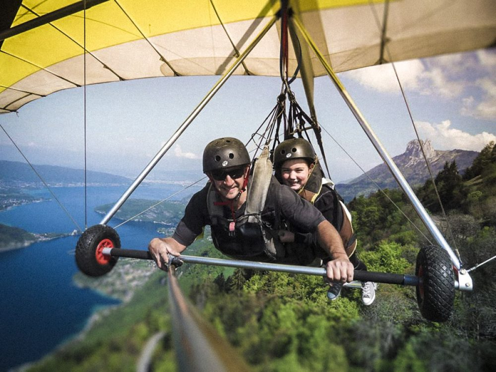
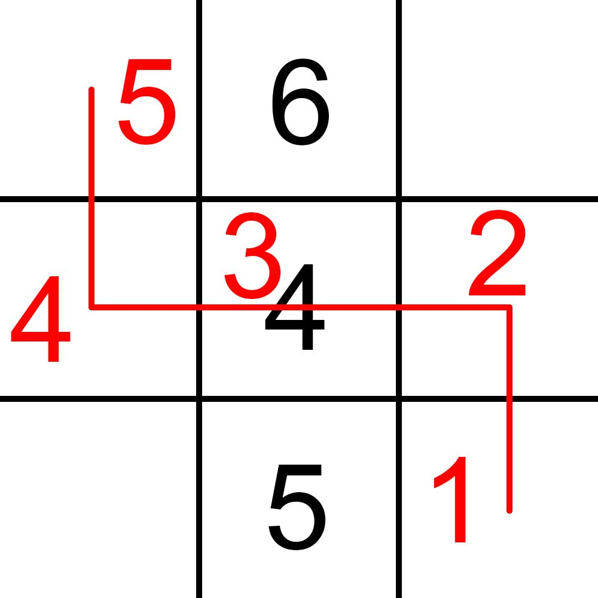
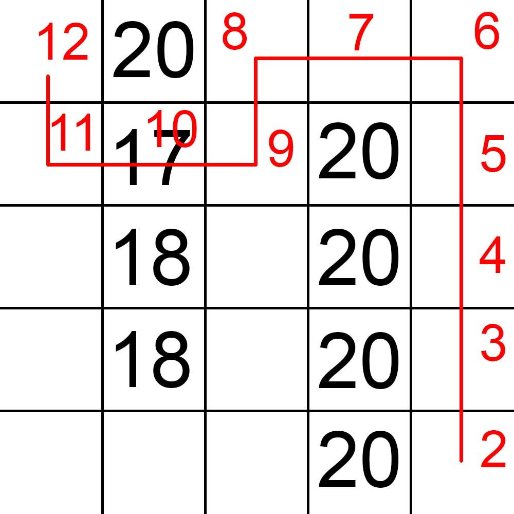
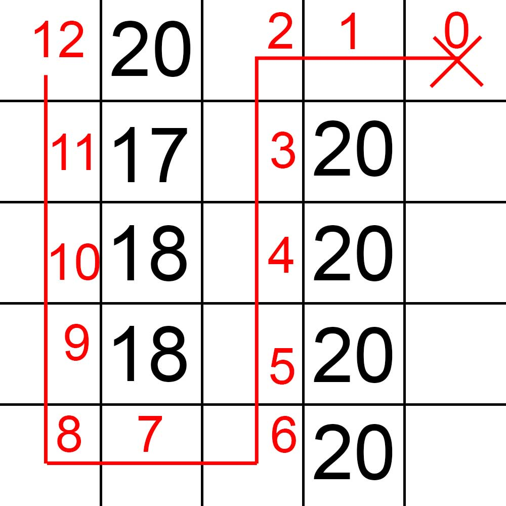

# Eco-conscious getaway

When all the ghosts are inside the vacuum cleaner, it starts to shake. A ghost sticks its head out, then one by one they all escape! You had forgotten that ghosts also go through vacuum cleaners. You remember that this is real life, not Luigi's Mansion. The ghosts pounce on you, and you start running as fast as you can through the manor. Your escape leads you to a balcony overlooking the random decision forest. In the distance, you see your family preparing to leave.

Then you notice a sparkling object: a hang-glider inadvertently placed there. There's only one solution: make the leap of faith. But beware, the hang glider is rapidly losing altitude and there are trees in your path, so it's up to you to avoid them or hit them. But hitting them with the hang glider would cut them off at the height you're passing through them. Your forest-loving heart can't take that. So you need to find a way to reach your family cutting the less tree height as possible.

The forest is represented as a grid, with certain squares occupied by trees of known height. You start at the top left, and glide your way down to the bottom right. With your hang-glider, you can move to adjacent squares in all 4 directions. But with each move, you lose 1m of altitude. If you pass over the square of a tree taller than your altitude, the portion of the tree above you is cut off. What is the minimum tree height you need to cut to cross the forest?

## Data

### Input

**Line 1**: Two integers `W` and `H`, the dimensions of the forest, `1 < W <= 100` and `1 < H <= 100`.

**Line 2**: An integer `S` starting height, `S > 0`.

**Line 3**: An integer `N` the number of trees in the forest, `0 <= N <= W*H - 2`.

**The following `N` lines**: 3 integers `x`, `y`, `h` representing the position `x`, `y` of the tree in the forest and its height `h` with :

- `0 <= x <= W-1` and `0 <= y <= H-1`,
- `(x, y) != (0, 0)` (start)
- `(x, y) != (W-1, H-1)` (finish)
- `h > 0`

### Output

The minimum height of tree to cut to reach your family, `impossible` if it's impossible, knowing that you start at point `(0, 0)` and that your family is at height `0` at point `(W-1, H-1)`.

## Examples

### Example 1

#### Input

```plaintext
3 3
5
3
1 0 6
1 1 4
1 2 5
```

#### Output

```plaintext
1
```

 We pass through the tree at the point where we have the smallest height difference from the tree (here 1).

### Example 2

#### Input

```plaintext
5 5
12
8
1 0 20
1 1 17
1 2 18
1 3 20
3 1 20
3 2 20
3 3 20
3 4 20
```

#### Output

```plaintext
7
```

Explanation: 
 

We have to go through a tree because the path without taking a tree is too long: 
