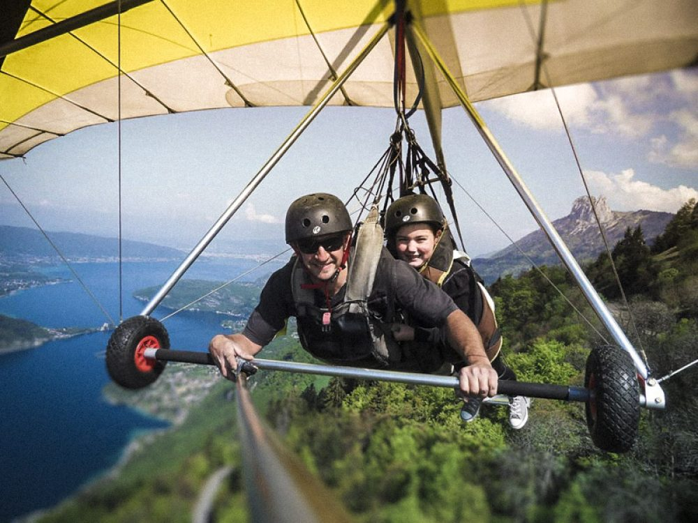
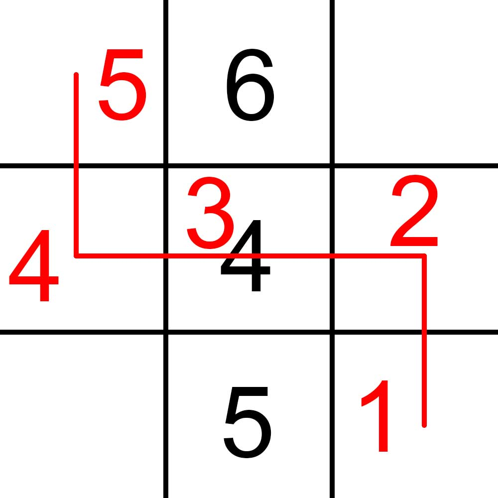

# Escapade éco-consciente

Alors que tous les fantômes se trouvent dans l'aspirateur, celui-ci se met à trembler. Un fantôme sort sa tête, puis ils s'échappent tous un à un ! En effet, vous aviez oublié que les fantômes passent aussi à travers les aspirateurs. Vous vous rappelez que c'est la vraie vie, et pas Luigi's Mansion. Les fantômes se jettent sur vous, vous vous mettez à courir le plus vite possible à travers le manoir. Votre fuite vous mène sur un balcon qui donne sur la forêt d'arbres décisionnels. Au loin, vous apercevez votre famille qui s'apprête à partir.

C'est alors que vous remarquez un objet étincelant : un deltaplane posé là par inadvertance. Une seule solution s'offre à vous : faire le grand saut. Mais attention, le deltaplane perd vite de l'altitude et des arbres sont sur votre chemin, c'est à vous de les éviter ou de les percuter. Mais les percuter avec le deltaplane les couperait net à la hauteur à laquelle vous passez. Votre cœur d'amoureux de la forêt ne peut pas supporter cela. Il vous faut donc trouver le chemin permettant d'atteindre votre famille en coupant le moins de hauteur d'arbre possible.

On représente la forêt comme un quadrillage, dont certaines cases sont occupées par des arbres dont on connait la hauteur. Vous partez d'en haut à gauche, et vous vous allez en bas à droite. Avec votre deltaplane, vous pouvez vous déplacer sur les cases adjacentes dans les 4 directions. Mais avec chaque déplacement, vous perdez 1m d'altitude. Si vous passez sur la case d'un arbre plus grand que votre altitude, la portion de l'arbre au-dessus de vous est coupée. Quelle est la hauteur minimale d'arbre à couper pour traverser la forêt ?

## Données

### Entrée

**Ligne 1** : Deux entiers `W` et `H`, les dimensions de la forêt, `1 < W <= 100` et `1 < H <= 100`.

**Ligne 2** : Un entier `S` la hauteur de départ, `S > 0`.

**Ligne 3** : Un entier `N` le nombre d'arbres dans la forêt, `0 <= N <= W*H - 2`.

**Les `N` lignes suivantes** : 3 entiers `x`, `y`, `h` représentant la position `x`, `y` de l'arbre dans la forêt et sa hauteur `h` avec :

- `0 <= x <= W-1` et `0 <= y <= H-1`,
- `(x, y) != (0, 0)` (départ)
- `(x, y) != (W-1, H-1)` (arrivée)
- `h > 0`

### Sortie

La hauteur minimale d'arbre à couper pour atteindre votre famille, `impossible` si c'est impossible, sachant que vous partez du point `(0, 0)` et que votre famille se trouve à hauteur `0` au point `(W-1, H-1)`.

## Exemples

### Exemple 1

#### Entrée

```plaintext
3 3
5
3
1 0 6
1 1 4
1 2 5
```

#### Sortie

```plaintext
1
```


On passe par l'arbre au moment ou on à l'écart de hauteur le plus petit avec l'arbre (ici 1).

### Exemple 2

#### Entrée

```plaintext
5 5
12
8
1 0 20
1 1 17
1 2 18
1 3 20
3 1 20
3 2 20
3 3 20
3 4 20
```

#### Sortie

```plaintext
7
```

Explication : 


En effet, on doit passer par un arbre car le chemin sans prendre d'arbre est trop long :
